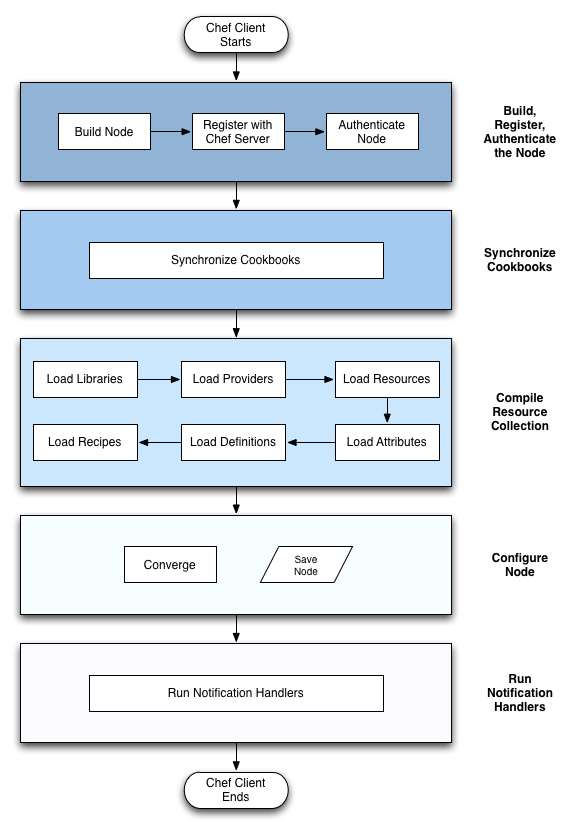
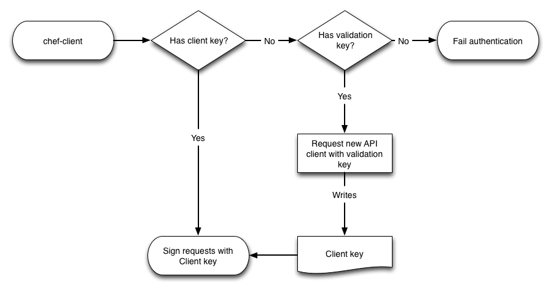

# Anatomy of a Chef Run

Section Objectives:

* Chef API Clients
* Chef Nodes
* Node convergence phases
* Notification handler types

.notes These course materials are Copyright © 2010-2012 Opscode, Inc. All rights reserved. 
This work is licensed under a Creative Commons Attribute Share Alike 3.0 United States License. To view a copy of this license, visit http://creativecommons.org/licenses/by-sa/3.0/us; or send a letter to Creative Commons, 171 2nd Street, Suite 300, San Francisco, California, 94105, USA.

# Anatomy of a Chef Run

.notes This diagram represents the process of running chef.

# Anatomy of a Chef Run

* Build the node
* Synchronize cookbooks
* Compile resource collection
* Configure the node
* Run notification handlers

# Build the Node

Before anything else happens, the system is profiled with Ohai.

Chef will use the detected fully qualified domain name (fqdn) for the node's name unless it was specified:

* `node_name` in `/etc/chef/client.rb`
* `chef-client -N`

Node names should be unique, they are used for the managed node and the API client.

# API Clients

*API Clients* authenticate with the Chef Server.

Chef uses Signed Header Authentication across all API requests. The header contains:

* HTTP method (GET/PUT/POST/DELETE)
* Request body in Base64
* Timestamp (use NTP!)
* Client ID (`node_name`)

# API Authentication

Does `/etc/chef/client.pem` exist?

* Use it to sign requests

Does `/etc/chef/validation.pem` exist?

* Request a new API client key
* Or fail

Was a new client key generated?

* Use it to sign requests

# API Authentication Process

# Users are Special API Clients

With Opscode Hosted Chef, individual users have special API clients.

Users are associated to an organization with Role-Based Access Control.

Users are granted privileges to Server-side objects with access control lists.

Users are global to Opscode Hosted Chef. *API Clients* (like systems running `chef-client`) are specific per organization.

# Node Objects

After the client has authenticated with the Server, Chef retrieves the node object from the server.

Node objects represent a set of data called attributes and a list of
configuration to apply called a run list.

# Node Object

`Chef::Node` is the node object. It looks and almost behaves like a hash, except when it doesn't.

Nodes have attributes at varying priority levels (automatic, default, normal, override).

Nodes have a run list.

.notes We talk about the internals of the Node object later.

# Node Object: JSON

    @@@javascript
    {
      "name": "www1.example.com",
      "json_class": "Chef::Node",
      "chef_type": "node",
      "chef_environment": "_default",
      "automatic": { ... },
      "default": { ... },
      "normal": { ... },
      "override": { ... },
      "run_list": [ ... ]
    }

.notes Name is the fqdn by default, JSON class is used internally, chef type tells the server how to index this object, environment specifies the environment, automatic-override are attribute levels, run list is an array

# Node Run List Expands

The run list can contain recipes and roles. Roles can contain recipes and also other roles.

Chef expands the node's run list down to the recipes. The roles and recipes get set to node attributes.

# Synchronize Cookbooks

Chef downloads from the Chef Server all the cookbooks that appear as recipes in the node's run list.

Chef also downloads all cookbooks that are listed as dependencies which might not appear in the run list.

If the node's `chef_environment` specifies cookbook versions, the Chef
downloads the version specified. Otherwise the latest available
version is downloaded.

# Cookbook Metadata

If a recipe from another cookbook is included in a recipe, it isn't automatically downloaded.

Some cookbooks don't actually have recipes, and instead provide helper code, libraries or other assets we want to use. 

To ensure the node has components needed in recipes, we declare dependencies in cookbook metadata.

# Cookbook Cache

Cookbooks are stored on the local system in the directory configured by "`file_cache_path`". The default is `/var/chef/cache` unless changed in `/etc/chef/client.rb`.

Cookbooks that have not changed are not downloaded again, the cached copy will be used.

# Chef Run

This starts when you see:

    INFO: Starting Chef Run for NODE_NAME

The run context is created with the node and the cookbook collection.

# Load Cookbooks

Once the cookbooks are synchronized to the local system, their components are loaded in the following order:

* Libraries
* Providers
* Resources
* Attributes
* Definitions
* Recipes (in the order specified)

# Cookbook Files and Templates

Cookbook static assets (files) and dynamic assets (templates) are not retrieved or loaded at this time.

They are retrieved from the server and rendered when needed by a resource in a recipe.

# Node Convergence

Convergence is when the configuration management system brings the
node into compliance with policy.

In other words, the node is configured based on the roles and recipes
in its run list.

Convergence in Chef happens in two phases.

* Compile
* Execute

# Convergence: Compile

* Chef recipe Ruby DSL is evaluated
* Ruby code is executed directly
* Recognized resources are added to the Resource Collection

# Convergence: Execute

Execute phase

* Chef runs the specified actions for each resource
* Providers know how to perform the actions

# Report and Exception Handlers

At the end of the Chef Run, report and exception handlers are triggered.

* Report handlers run when Chef exits cleanly
* Exception handlers run when Chef exits abnormally with an unhandled exception.

# Report Handlers

Normal, clean exit:

    INFO: Chef Run complete in 42.72288 seconds
    INFO: Running report handlers
    INFO: Report handlers complete

# Exception Handlers

Abnormal exit from unhandled exception:

    ^CFATAL: SIGINT received, stopping
    FATAL: SIGINT received, stopping
    ERROR: Running exception handlers
    ERROR: Exception handlers complete

# Summary

* Chef API Clients
* Chef Nodes
* Node convergence phases
* Notification handler types

# Questions

* What is an API client?
* How does the API client get created automatically?
* How is an API client different from a node?
* What are the two main components of a node object?
* How does Chef determine what cookbooks to download?
* Where do cookbooks get downloaded?
* What are the two phases of node convergence and how do they differ?
* What is the difference between a report and exception handler?
* Student questions?

# Additional Resources

* http://wiki.opscode.com/display/chef/Anatomy+of+a+Chef+Run
* http://wiki.opscode.com/display/chef/Authentication
* http://wiki.opscode.com/display/chef/Chef+Client
* http://wiki.opscode.com/display/chef/Nodes
* http://wiki.opscode.com/display/chef/Attributes
* http://wiki.opscode.com/display/chef/Evaluate+and+Run+Resources+at+Compile+Time

# Lab Exercise

Anatomy of a Chef Run

* Configure remote target to run `chef-client`
* Successful `chef-client` run with debug logging
