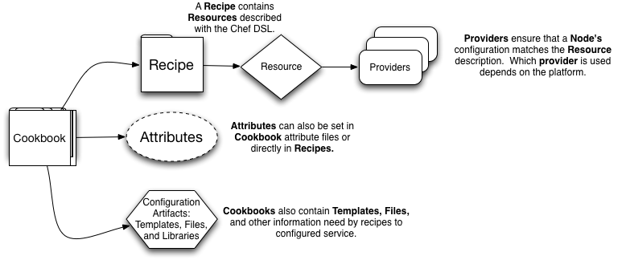

# Cookbooks, Recipes, Resources

Section Objectives:

* Understand components of a cookbook
* Create new cookbooks
* Download cookbooks from the Community site
* Understand and write simple recipes
* Recognize Chef resources

.notes These course materials are Copyright © 2010-2012 Opscode, Inc. All rights reserved.
This work is licensed under a Creative Commons Attribution Share Alike 3.0 United States License. To view a copy of this license, visit http://creativecommons.org/licenses/by-sa/3.0/us; or send a letter to Creative Commons, 171 2nd Street, Suite 300, San Francisco, California, 94105, USA.

# Cookbooks Overview

Cookbooks are the fundamental units of distribution in Chef. They are "packages" for Chef recipes and other helper components.

They are designed to be sharable packages for managing infrastructure as code. Cookbooks can be shared within an organization, or with the Chef Community.

Nodes managed by Chef download cookbooks from the Chef Server to apply their configuration.

# Cookbook Basics

# Creating Cookbooks

Cookbooks are merely a structured set of directories in your Chef Repository.

Create a new cookbook in the `cookbooks` directory. The content of the recipe and metadata.rb don't matter right now, they just need to exist.

    mkdir cookbooks/webserver
    mkdir cookbooks/webserver/recipes
    touch cookbooks/webserver/recipes/default.rb
    touch cookbooks/webserver/metadata.rb

.notes It is worth noting that the metadata OR recipes can be absent, but not both. The cookbook must have one or the other for knife to upload it.

# Cookbook Components

The most commonly used cookbook components are:

* recipes
* metadata
* assets (files and templates)

# Common Components: Metadata

Chef Cookbook metadata is written using a Ruby domain-specific language.

Metadata serves two purposes.

* Documentation
* Dependency management

# Metadata Documentation

Cookbook metadata can contain documentation about the cookbook itself.

    maintainer       "Opscode, Inc."
    maintainer_email "cookbooks@opscode.com"
    license          "apachev2"
    description      "Configures web servers"
    long_description "Configures web servers with a cool recipe"

# Metadata Dependency Management

Metadata is also used for dependency management.

Cookbook dependencies are implied when using part(s) of one cookbook in another, such as recipe inclusion.

Cookbook dependencies are explicitly defined in metadata with the `depends` field.

# Metadata Dependency Management

Related to dependency management is version management. Cookbooks can be versioned, and dependencies on versions can be declared.

Specify a cookbook's version with the `version` field.

# Cookbook Dependencies

The metadata defines the additional cookbooks required that might not appear in the run list explicitly.

When cookbooks are uploaded, the Ruby code is parsed by Knife and translated to JSON when it is stored on the Chef Server.

This is a security feature, so the Chef Server does not execute user-defined Ruby code.

# Common Components: Assets

One of the most common things to manage with Chef are configuration files on the node's filesystem.

* /etc/mysql/my.cnf
* /var/www/.htaccess
* C:\Program Files\My Application\Configuration.ini

Chef cookbooks can contain `files` and/or `templates` directories to contain the source files for these resources as we'll see later.

# Common Components: Recipes

Recipes are the work unit in Chef. They contain lists of resources that should be configured on the node to put it in the desired state to fulfill its job.

Nodes have a run list, which is simply a list of the recipes that should be applied when Chef runs.

The node will download all the cookbooks that appear in its run list.

.notes We're not talking about roles yet, just recipes.

# Chef Recipes

Recipes contain lists of resources.

Resources are declarative abstract interfaces to OS resources like packages, services, config files and users.

Information about the node itself is available via the `node` object.

.notes We will discuss the node object in greater detail later.

# Chef Recipes

Recipes are an internal Ruby domain-specific language (DSL).

* You need a 3rd generation programming language.
* You can’t be limited by the language.

.notes We will cover basics of Ruby in greater detail in a later section, "Just Enough Ruby for Chef"

# How Are Recipes Applied?

Nodes have a list of recipes they will run.

This run list can include recipes that also include other recipes.

These are applied to the node in the order listed.

# Chef Recipes

Recipes are processed in the order they are written.

* Ruby code is evaluated.
* Ruby recognized as Resources are added to the resource collection.
* Chef walks the resource collection to configure the resources.
* Providers take action to configure the resource as it was declared.

# Resources

Resources are the fundamental configuration object.

Chef manages resources on the node so it can be configured to do its job.

# Resources

Declare some aspect of policy

* The apache2 package should be installed.
* The application user should be created.

# Resources

Resources abstract the details of how to configure the system. The commands:

    @@@sh
    apt-get install apache2
    useradd application

Become resources:

    @@@ruby
    package “apache2”
    user “application”

# Resources

Resources take idempotent actions through providers.

Providers know how to determine the current state of the resource on the node.

Providers do not take action if the resource is in the declared state.

# Node Convergence

If the node isn't configured to do its job, it needs to be converged.

Chef converges the node to bring it closer to being fully configured.

A single Chef run should completely converge the node.

# Resources

Resources are data driven.

* Packages have versions
* Users have home directories, shells and numeric IDs.

This data can come from multiple sources, either by writing in the code itself or an external source.

# Resources Chef Can Configure

* directories, files, templates, remote files
* packages, services, users, groups
* scripts, commands, ruby code blocks
* subversion and git code repositories
* application deployment, HTTP requests
* network interfaces, filesystem mounts

Chef includes over 25 different kinds of resources.

# User-created Resources

Chef is flexible and extensible and new resources and providers can be
created.

* Cookbook LWRPs (Lightweight DSL)
* Cookbook Libraries

.notes Libraries are beyond the scope of this class. LWRPs will be covered briefly later.

# Resource Components

* Resources have a type
* Resources have a name
* Resources take parameter attributes
* Resources specify the action to take

# Example Resource

    @@@ ruby
    template "/tmp/config.conf" do
      source "config.conf.erb"
      owner "root"
      group "root"
      mode 0644
      action :create
    end

.notes in the absense of parameters, default values are assumed. same
with actions

# Sane Default for Resources

Each resource has a "name attribute."

This corresponds to a parameter attribute as the default value.

Parameter attributes all have default values internal to Chef. Specify your own to be explicit, or to change the default.

Resources also have a default action. The default value depends on the
resource type.

# Common Recipe Patterns

Many cookbooks will have a similar set of resources:

* Packages
* Configuration files
* Services

# Package Resource

    @@@ruby
    package "fail2ban" do
      action :upgrade
    end

The upgrade action is like install but if Chef determines a newer version is available, it will update.

The fail2ban package will only have security fixes so it is safe to upgrade.

# Service Resource

    @@@ruby
    service "fail2ban" do
      supports [ :status => true, :restart => true ]
      action [ :enable, :start ]
    end

The fail2ban service specifies a meta-parameter, “supports.” This affects the way the service provider works with the service init script.

We can specify multiple actions by passing an array. These are processed by Chef in order.

# Template Resources

The resource takes several parameters.

    @@@ruby
    template "/etc/fail2ban/fail2ban.conf" do
      source "fail2ban.conf.erb"
      owner "root"
      group "root"
      mode 0644
      notifies :restart, "service[fail2ban]"
    end

# Distributing Cookbooks

* With version control
* With nodes to be configured
* With the Community

# Version Control

Use a version control system for your Chef Repository where the cookbooks are stored.

Community best practice is Git. However, other DVCS are common. Use the preferred tool for your organization.

It is beyond the scope of this course to discuss version control strategies in depth.

Storing a cookbook in version control does not make it available to Chef. It must be uploaded to the Chef Server.

# Nodes and Chef Server

In order for nodes to be configured with Chef, the cookbooks they need must be uploaded to the Chef Server.

    knife cookbook upload COOKBOOK

.notes Chef Server uses an API for uploading cookbooks

# Chef Community Cookbooks

Opscode hosts the Chef Community site where Chef users share cookbooks:

* [http://community.opscode.com/](http://community.opscode.com/)

Knife includes sub-commands for working with the site.

    knife cookbook site --help

# Finding Cookbooks

Knife's `cookbook site` sub-commands can be used to find cookbooks.

    knife cookbook site list
    knife cookbook site show COOKBOOK
    knife cookbook site search QUERY

QUERY is a simple single term, e.g. "webserver" or "security".

# Downloading Cookbooks

Use the `download` command to download a tarball of a cookbook from the site. Then extract the archive into the cookbooks directory.

    knife cookbook site download COOKBOOK
    tar -zxvf COOKBOOK-VERSION.tar.gz -C cookbooks

# Version Control Integration

The `install` command can automatically integrate the cookbook into the local repository if it is managed with Git.

    knife cookbook site install COOKBOOK

This uses a "vendor branch" pattern with Git.

(future versions of Chef will support other version control systems)

.notes Vendor branch pattern: download cookbook tarball; check out branch for the cookbook; untar cookbook into the branch; commits changes w/ git; merges back into integration (master) branch.

# Summary

# Lab Exercise
