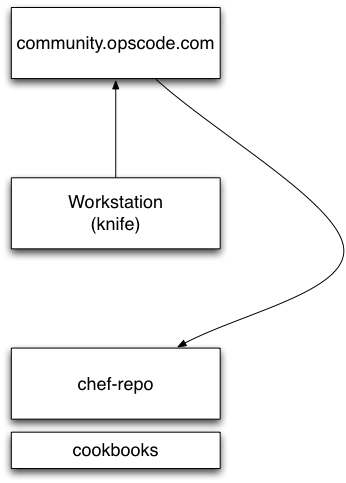

# Example Cookbook

.notes These course materials are Copyright © 2010-2012 Opscode, Inc. All rights reserved.
This work is licensed under a Creative Commons Attribute Share Alike 3.0 United States License. To view a copy of this license, visit http://creativecommons.org/licenses/by-sa/3.0/us; or send a letter to Creative Commons, 171 2nd Street, Suite 300, San Francisco, California, 94105, USA.

# Objectives

At completion of this unit you should...

* Know how to get cookbooks with Knife from the Opscode Chef Community site
* Understand the components of a cookbook
* Be able to upload a cookbook to Opscode Hosted Chef
* Add a cookbook’s recipe to a node’s run list.

# Chef Cookbooks

Cookbooks are "packages" for Chef recipes and other helper components.

You can create new cookbooks or download cookbooks from the Cookbooks
site.

# Cookbooks are Sharable

Opscode designs cookbooks to be sharable with others. Attributes,
allow you to interchange data. Use file specificity to customize the
files and templates for particular platforms. Resources, providers and
libraries you can extend cookbooks.

These features of cookbooks bring flexibility and code reuse for your
infrastructure.

# Cookbook Basics

Cookbooks contain a variety of components. The most commonly used are:

* recipes
* files and templates
* metadata

# Getting Cookbooks

Opscode hosts the Chef Community site

* http://community.opscode.com

Install cookbooks from the site in the local chef-repo with knife’s vendor pattern.

    knife cookbook site install COOKBOOK

Or, download a .tar.gz with knife:

    knife cookbook site download COOKBOOK

# Getting Cookbooks

# knife cookbook site download

    knife cookbook site download fail2ban
    tar -zxvf fail2ban-1.0.0.tar.gz -C cookbooks

Simply downloads a tarball of the cookbook from the site.

Follow version control patterns: Create a branch, merge, etc.

# knife cookbook site install

    knife cookbook site install fail2ban

* Uses "vendor branch" pattern with Git.
* Downloads the cookbook from the site as a tarball
* Checks out a "vendor branch" for the cookbook
* Untars the cookbook into the vendor branch
* Commits the changes with git
* Merges back into master

.notes knife includes a command to do the version control parts automatically for you.

# fail2ban Cookbook

"fail2ban" blocks SSH and other TCP connections via firewall rules based on failed login attempts.

It’s useful to have as a security measure.

This cookbook will set up fail2ban on a Linux node.

# Knife Cookbook Site Commands

    knife cookbook site show fail2ban
    knife cookbook site search fail2ban
    knife cookbook site search security

# Download fail2ban to Repository

Download the cookbook from the community site.

    > cd ~/chef-repo
    > knife cookbook site download fail2ban

Then, uncompress the `.tar.gz` into the cookbooks directory, it can be removed afterward.

    > tar -zxvf fail2ban.tar.gz -C cookbooks
    > rm fail2ban.tar.gz

# Common Recipe Patterns

The fail2ban cookbook follows a common recipe pattern.

* Install a package
* Create configuration files from templates
* Manage a service

# Package Resource

    @@@ruby
    package "fail2ban" do
      action :upgrade
    end

The upgrade action is like install but if Chef determines a newer version is available, it will update.

The fail2ban package will only have security fixes so it is safe to upgrade.

.notes What is it in Chef that determines whether there is a newer version of the package available?

# Service Resource

    @@@ruby
    service "fail2ban" do
      supports [ :status => true, :restart => true ]
      action [ :enable, :start ]
    end

The fail2ban service specifies a meta-parameter, "supports." This affects the way the service provider works with the service init script.

We can specify multiple actions by passing an array. These are processed by Chef in the order specified - first enable, then start.

# Template Resources

    @@@ruby
    %w{ fail2ban jail }.each do |cfg|
      template "/etc/fail2ban/#{cfg}.conf" do
        source "#{cfg}.conf.erb"
        owner "root"
        group "root"
        mode 0644
        notifies :restart, "service[fail2ban]"
      end
    end

This is two template resources set up by using the Ruby "each" loop over an array.

The %w{ } syntax creates a quoted array of words.

The resource takes several parameters.

# Template Source Files

    fail2ban/templates/
    `-- default
        |-- fail2ban.conf.erb
        `-- jail.conf.erb

For templates, the source files are ERB (embedded Ruby), generated by the node.

Dynamic templates and static files in cookbooks follow rules of file specificity.

# File Specificity

File specificity is how Chef determines source file for files and templates
Directory locations under files or templates:

* host-FQDN
* PLATFORM-VERSION
* PLATFORM
* default

FQDN is `node[‘fqdn’]`. PLATFORM is `node[‘platform’]` and VERSION is `node[‘platform_version’]`.

# File Permissions

The file resource type has three file permission parameters.

* owner
* group
* mode

These are inherited by template, `cookbook_file` and `remote_file` resources.

Be explicit.

# Notification meta-parameter

    @@@ruby
    resource "name" do
      notifies :action, "resource_type[resource_name]", :timing
    end

Notifications tell a resource take an action when this resource is updated.

The basic form of a notification parameter for a resource.

Timing can be :delayed or :immediately. :delayed is the default.

# Template Notifications

    @@@ruby
    %w{ fail2ban jail }.each do |cfg|
      template "/etc/fail2ban/#{cfg}.conf" do
        #...
        notifies :restart, "service[fail2ban]"
      end
    end

Notifications can be sent or received between resources.

"Subscribes" is the opposite of notifies.

Multiple notifications with the same action get stacked but only triggered the first time.

# Cookbook Upload

Upload the cookbook to Opscode Hosted Chef with knife.

    knife cookbook upload fail2ban

This uploads the contents of the `chef-repo/cookbooks/fail2ban`
directory.

# knife cookbook upload fail2ban

    > knife cookbook upload fail2ban
    Uploading fail2ban             [1.0.0]
    upload complete

    > knife cookbook upload fail2ban -VV
    [ more verbose DEBUG output ]

    > knife cookbook show fail2ban 1.0.0

Check Ruby and ERB (template) syntax.

Create a "sandbox," which is in a private Amazon S3 bucket with filenames as checksums.

Write the cookbook manifest.

# Add Recipe to a Node

The cookbook sets the namespace for the recipe to add to the node. The default recipe can be omitted.

    recipe[fail2ban]
    recipe[fail2ban::default]

Are equivalent.

# Add Recipe to a Node

Use knife to add a recipe to a node’s run list.

    knife node run list add NODE ‘recipe[fail2ban]’

Use quotes to prevent shell meta-character expansion.

Run Chef on the node and it will apply the recipe.

# Add Recipe to a Node

Knife's bootstrap subcommand will SSH to a node, automatically install
Chef, configure the node to connect to the server and run Chef with
the specified run list.

    knife bootstrap NODE -r "recipe[fail2ban]"

# Add Recipe to a Node with JSON

`chef-client` can take a command-line argument, `-j`, which is a JSON file that contains information abou the node.

This is mainly used to set the initial state of the node if it doesn't already exist on the Chef Server. Most commonly this is to set the node's initial run list.

# Node Run List in JSON

The run list is specified in JSON as an array.

    @@@ javascript
    { "run_list": [ "recipe[fail2ban]" ] }

To add other recipes (or roles), each item should be comma separated.

    { "run_list": [ "recipe[fail2ban]", "role[www]" ] }

# Summary

You should now be able to...

* Describe common components of a cookbook
* Get cookbooks with Knife and the Opscode Chef Community site
* Upload a cookbook to Opscode Hosted Chef
* Add a cookbook’s recipe to a node’s run list.

# Additional Resources

* http://wiki.opscode.com/display/chef/Cookbooks
* http://community.opscode.com/cookbooks
* http://www.slideshare.net/jtimberman/mwrc2011-cookbook-design-patterns
* http://jtimberman.housepub.org/blog/2011/09/03/guide-to-writing-chef-cookbooks/

# Lab Exercise

## Example Cookbook
