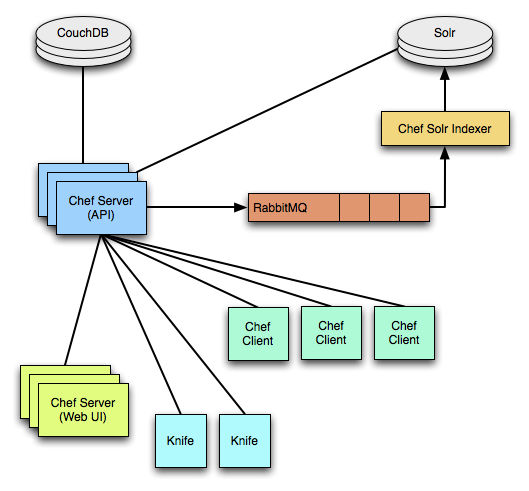
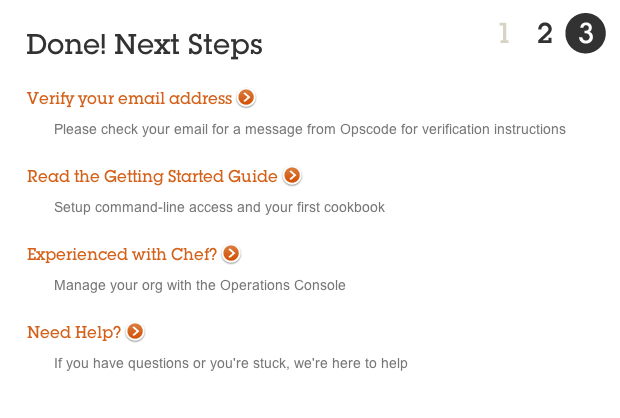
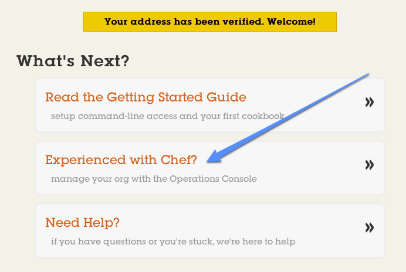
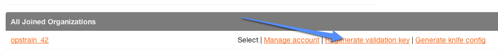
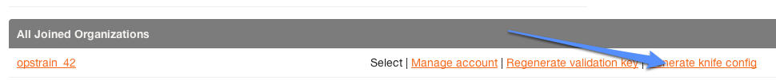
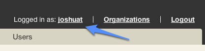

# Getting Started

Section Objectives

* Install Ruby and Chef
* Get familiar with the tools that come with Chef
* Set up connectivity to a Chef Server
* Create an initial Chef Repository

.notes These course materials are Copyright © 2010-2012 Opscode, Inc. All rights reserved.
This work is licensed under a Creative Commons Attribute Share Alike 3.0 United States License. To view a copy of this license, visit http://creativecommons.org/licenses/by-sa/3.0/us; or send a letter to Creative Commons, 171 2nd Street, Suite 300, San Francisco, California, 94105, USA.

# Supported Platforms

Opscode supports Chef Clients on the following platforms:

* Ubuntu (10.04, 10.10, 11.04, 11.10, 12.04)
* Debian (5.0, 6.0)
* RHEL & CentOS (5.x, 6.x)
* Fedora 10+
* Mac OS X (10.4, 10.5, 10.6, 10.7, 10.8)
* Windows 7
* Windows Server 2003, 2003 R2, 2008, 2008 R2

# Additional Platforms

Chef Client is known to also run on the following platforms:

* Ubuntu (6.06, 8.04-9.10)
* Gentoo (11.1,11.2)
* FreeBSD (7.1-9.0+)
* OpenBSD (4.4+)
* OpenSolaris (2008.11) / OpenIndiana / SmartOS
* Solaris 5.10 (u6)
* SuSE (11.x)
* Windows XP, Vista

.notes Opscode does not fully test every aspect of Chef on these platforms, but Chef Client is known to run and applicable built in resources work.

# Ruby and Chef

Chef is written in Ruby, an interpreted object oriented programming language.

Much of the code you'll work with for Chef is Ruby, albeit domain-specific language(s) suited for the task.

In order to install and use Chef, we need to have Ruby installed and available. It is important to understand some nuances about Ruby installation, first.

# Ruby Versions

Ruby is an interpreted language and has several interpreter VMs available. The most common is "MRI" or the "Matz Ruby Interpreter"

The latest stable version of MRI is [Ruby 1.9.3](http://ruby-lang.org).

Chef requires at least Ruby 1.8.7.

.notes Versions are current as of the latest update to these materials.

# Platform Packages

Ruby and parts of the Ruby ecosystem have a reputation for backwards incompatibility. As such, not all platforms have the latest version available as the default package for "ruby".

Most Linux/Unix variants package version 1.8.7; it is an API-compatible transition version between 1.8 and 1.9.

Some make 1.9 version(s) available, but few use it as the default version.

.notes Debian (wheezy/testing) and Ubuntu (oneiric+) use their alternatives system to make ruby1.9.1 available to be used as a default ruby installed as an OS package.

# RubyGems

Ruby software and libraries are usually published as Gems, using the Ruby packaging system *RubyGems*. Gems are published to http://rubygems.org/

Prior to Ruby 1.9, RubyGems was separately installed. It has been added to Ruby 1.9 in the standard library, at RubyGems version 1.3.7.

Chef requires at least RubyGems 1.3.7.

.notes The `gem_package` provider uses library/API calls that were introduced in RubyGems 1.3.7. Some instructions or automated installations of Chef install newer versions of RubyGems by default.

# Installing Ruby and RubyGems

Chef is distributed primarily as a RubyGem, therefore Ruby and RubyGems need to be installed. Assuming the version requirements are met, we can simply install the Chef gem:

    % sudo gem install chef

# Were it that simple...

For some platforms, getting the required versions of Ruby and RubyGems for Chef is not trivial.

The current version of Ruby not being packaged by default has lead to other solutions, primarily centered around installing Ruby from source, to emerge.

Compiling from source is time consuming, and many (most?) system administrators prefer to install all software using packages.

# Introducing Omnibus

Opscode needed a better way to distribute Chef so it is easier for customers and community members to install.

We also need a consistent installation method that our support team can troubleshoot.

# Omnibus Build System

Opscode created the package build system "omnibus" to generate full-stack binary installers for Chef in a variety of formats.

* Native packages (rpm, deb)
* Self-extracting executable Tar.gz
* Microsoft Software Installer (MSI)

The idea is that all the software required above the standard C library for the OS is included. In Chef's case this is autoconf, openssl, zlib, Ruby, RubyGems and more.

.notes Omnibus is the name of the project for the build tool. These packages are often called "omnibus" packages. It is currently used for Chef, but can build other software stacks, too.

# Installing Chef Full

Omnibus is the build tool. The installation packages are called "chef-full".

Instructions for installation are at:

* [http://opscode.com/chef/install](http://opscode.com/chef/install)

# Supported Platforms

Installers are created for the following platforms. This may be different than the list of supported platforms, earlier.

* Debian, Ubuntu
* RHEL, CentOS, Scientific Linux, Oracle Enterprise Linux
* Fedora, Amazon Linux
* Mac OS X
* OpenIndiana
* Windows (Server 2003, 2008)

# Linux/Unix Installation

Installation on Linux and Unix is done with a shell script:

    % curl -L http://opscode.com/chef/install.sh | sudo bash

The script detects the platform of the system to determine what installation file to download.

# Windows Installation

Installation on Windows is done by downloading the MSI and installing it.

* [http://opscode.com/chef/install.msi](http://opscode.com/chef/install.msi)

Server versions are directly tested, but the MSI is known to install and work fine on desktop versions of Windows such as Vista and 7.

.notes Do this now. Download the MSI and install it.

# What You Get: Linux/Unix

Chef binaries are in `/opt/opscode/bin`. The package installation symlinks them in `/usr/bin` so they are in the default `$PATH`.

Other binaries are in `/opt/opscode/embedded/bin`. This includes `ruby`, `gem`, and binaries for other included software like autoconf, openssl and more.

# What You Get: Windows

Chef binaries are in `C:\opscode\bin`. The other binaries are in `C:\opscode\embedded\bin`.

These directories are both added to the system `%PATH%`.

# Chef Full Ruby

The Ruby included in the Chef Full stack installation package is intended for Chef's use.

If Ruby is required for other tools or applications on the system, Opscode recommends installing it with a recipe.

If you wish to install Chef extensions such as knife plugins, report handlers or gems used in cookbooks, use the full-stack included Ruby.

# Chef Toolbox

Chef comes with several tools of its own.

* ohai
* chef-client and chef-solo
* knife
* shef

# Other Tools

In working with infrastructure, we have several tools in the toolbox.

Non-Chef tools:

* Shell (Bash, Zsh, Powershell, Cmd.exe)
* Text editors (Emacs, Vim, Notepad++)
* Version control systems (Git, Subversion, Perforce)
* Ruby programming language

.notes Coverage of these tools is outside the scope of the class.
Students are assumed to have knowledge and familiarity with the shell,
text editor and version control system of their choice sufficient for
working in the hands on exercises.

# Chef Tools

Each of the tools bundled with the Chef Full package share some common traits.

* Built-in help
* Configuration

# Built-in Help

Each command has a `--help` or `-h` command-line option that displays options and contextual help output.

Each command also has a corresponding Unix `man(1)` page, which is included in the installed Chef library.

# Built-in Help

As Windows does not have a `man(1)` help system, HTML pages are generated. These are located in:

* C:\opscode\chef\embedded\lib\ruby\
  gems\1.9.1\gems\chef-VERSION\distro\common\html

Where "VERSION" is the version of Chef.

A future release will have helpers to make these easier to access.

# Configuration

Each tool that Chef comes with has its own configuration file.

Configuration files populate values in the `Chef::Config` object.

Chef comes with sane default values for all configuration options.

Context of the configuration file to the appropriate tool is important.

# Chef Configuration

`Chef::Config` uses a simple domain specific language where the setting and its value are specified.

    @@@ruby
    log_level :info
    log_location STDOUT
    chef_server_url "https://api.opscode.com/organizations/opstrain"

# Ohai

Ohai is a standalone library written by Opscode that is installed with Chef as a dependency.

Ohai uses plugins to profile the local system when Chef runs to gather
information.

When Chef runs, this data gets stored on the Chef Server.

# Ohai Configuration

Ohai is usually configured via the chef-client configuration file
(`/etc/chef/client.rb`). It has no other configuration file.

The ohai configuration must be modified with `Ohai::Config`. It is a Ruby hash-like object that uses symbols for key names.

    @@@ruby
    Ohai::Config[:disabled_plugins] << 'passwd'

.notes Disabling plugins is the most common configuration to do for Ohai. We won't detail more configuration at this time.

# Knife

Knife is the "swiss army knife" of infrastructure management tools.

* manage the local Chef repository
* interact with the Chef Server API
* interact with cloud computing providers' APIs
* extend with custom plugins/libraries

# Knife Sub-commands

Knife plugins are used as sub-commands. General format of knife sub-commands:

    knife COMMAND verb noun (options)

This is consistent for Chef API, but some differences across other uses.

# Knife Command Examples

    knife node show NODENAME
    knife cookbook upload fail2ban
    knife role edit webserver

# Knife Contextual Help

    knife --help
    knife sub-command --help
    knife sub-command verb --help

# Knife Man Pages

Knife has built-in man pages.

    knife help
    knife help list
    knife help knife
    knife help TOPIC
    knife help node

.notes These probably won't work on Windows, which doesn't have a "man" system. The files are also rendered as html and can be found in the Chef MSI.

# Knife Configuration

The default configuration file for Knife is `.chef/knife.rb`; knife looks for it automatically, similar to `git`:

    $PWD/.chef/knife.rb
    $PWD/".."/.chef/knife.rb
    ~/.chef/knife.rb

Opscode Hosted/Private Chef provides a pregenerated `knife.rb` you can use.

# Knife Configuration Options

Knife configuration uses `Chef::Config`.

Knife also has its own specific configuration for various plugins to
use. These are in `Chef::Config[:knife]`, which is a hash of
configuration options.

.notes Configuration options in knife are like other parts of Chef,
the data is a hierarchy of key/value pairs, and where we are in the
hierarchy is context specific.

# Knife Configuration

To work with the Chef Server API, Knife must be configured with:

* The Chef Server's URL (chef\_server\_url).
* The user to authenticate to the API (node\_name).
* The private key for the authenticating user (client\_key).

.notes In the API, users (as knife) and API clients (like chef-client)
are "actors"

# Knife Configuration

Minimal `knife.rb` configured to use a particular Opscode Hosted Chef organization and Opscode user.

    @@@ruby
    node_name       "opscode-trainer"
    client_key      "opscode-trainer.pem"
    chef_server_url "https://api.opscode.com/organizations/opstrain"

.notes We will talk more about how the authentication system works in Chef later in Anatomy of a Chef Run

# Knife User

The configuration value `node_name` in the `knife.rb` refers to an Opscode user.

Users are global to the entire Opscode service.

Users may be associated to one or more organizations.

# Knife Configuration

We work with a local Chef Repository that stores the various files, including cookbooks, that should be sent to the Chef Server. Knife is written to automatically use these locations.

One directory it does need to be told is the path where cookbooks live.

    @@@ruby
    cookbook_path "./cookbooks"

This configuration file is Ruby, not bash, so we need to be careful with the path usage. The default `knife.rb` provided with a Hosted Chef account through the webui will have this already set for you.

# Knife Configuration

The cookbook path in the pre-generated Knife configuration file uses a relative location based on the location of the `knife.rb` file.

    @@@ruby
    current_dir = File.dirname(__FILE__)
    cookbook_path ["#{current_dir}/../cookbooks"]

# Knife Command-line Options

Knife has a base set of command-line options that correspond to general options in the `knife.rb`.

Each sub-command may have specific command-line options that are different.

# Knife Command-line Options

The following command-line options correspond to the config file settings seen above:

    | Command-line Option  | knife.rb        |
    |----------------------|-----------------|
    | -s, --server-url URL | chef_server_url |
    | -k, --key KEY        | client_key      |
    | -u, --user USER      | node_name       |

# Knife Command-line Options

Other common command-line options used with knife.

    | Command-line Option  | Purpose             |
    |----------------------|---------------------|
    | -c, --config CONFIG  | Configuration file  |
    |                      | to use.             |
    | -V, --verbose        | Verbose output, can |
    |                      | be specified twice. |
    | -F, --format         | Output format, can  |
    |                      | be json, yaml, text |

.notes We'll discuss other options as we progress through the course.

# Chef Client & Chef Solo

The programs `chef-client` and `chef-solo` load the Chef library and make it available to apply configuration management with Chef.

Both programs know how to configure the system given the appropriate recipes found in cookbooks.

# Chef Client

chef-client talks to a Chef Server API endpoint, authenticating with an RSA key pair. It retrieves data and code from the server to configure the node per the defined policy.

List of recipes can be predefined, assigned to a node on the Chef
Server, and retrieved when chef-client runs.

The default configuration file is `/etc/chef/client.rb`.

# Chef Client Configuration

Like Knife, `chef-client` must be configured with the proper authentication information to connect to the Chef Server.

Unlike Knife, the `node_name` is not a user, but the actual system's name for itself. Unless otherwise specified in `/etc/chef/client.rb`, the `node_name` is the value detected by Ohai as the `fqdn` (fully qualified domain name).

.notes We will talk more about authentication in Anatomy of a Chef run.

# Chef Client Configuration

The minimal configuration for `chef-client` in `/etc/chef/client.rb` to talk to the Chef Server:

    @@@ruby
    chef_server_url  "https://api.opscode.com/organizations/opstrain"
    validation_client_name "opstrain-validator"

All other options will use default values, which are meant to be sane defaults.

.notes "opstrain" here is the organization name, each organization will have its own value.

# Chef Client Configuration

Other common configuration options (default values are used below):

    @@@ruby
    log_level        :info
    log_location     STDOUT
    verbose_logging  true
    file_cache_path  "/var/chef/cache"
    file_backup_path "/var/chef/backup"
    json_attribs     nil

# Client Command-line Options

The following command-line options correspond to the specified config file settings.

    | Command-line Option  | client.rb       |
    |----------------------|-----------------|
    | -S, --server URL     | chef_server_url |
    | -k, --key KEY        | client_key      |
    | -N, --node-name NAME | node_name       |

# Client Command-line Options

Other common command-line options used with `chef-client`:

    | Command-line Option   | client.rb    |
    |-----------------------|--------------|
    | -l, --log_level LEVEL | log_level    |
    | -L, --logfile LOGFILE | log_location |
    | -j JSON_ATTRIBUTES    | json_attribs |

# Client Command-line Options

The following options control how the `chef-client` process behaves.

    | Command-line Option   | Purpose                        |
    |-----------------------|--------------------------------|
    | -d, --daemonize       | Daemonize the process          |
    | -i, --interval INT    | Run every INT seconds          |
    | -s, --splay SECONDS   | Random splay added to interval |
    | -u, --user USER       | User to run chef-client as     |

# Full example client.rb

    @@@ruby
    log_level        :info
    log_location     STDOUT
    chef_server_url  "https://api.opscode.com/organizations/ORGNAME"
    validation_client_name "ORGNAME-validator"
    # Using default node name

# Command-line Options Override

Options passed on the command-line override values in the configuration file.

    @@@sh
    chef-client -l debug
    chef-client -N node-name
    chef-client -S https://api.opscode.com/organizations/OTHER
    chef-client --help

# Chef Solo

chef-solo operates without a Chef Server. It requires that all the
recipes it needs are available, and that it be told what to run on the
node.

A JSON file is passed to chef-solo to give it these instructions in a
`run_list` for the node.

The default configuration file is `/etc/chef/solo.rb`.

# Solo Command-line Options

`chef-solo` does not connect to a server, so it doesn't have options for interacting with a server. Common command-line options:

    | Command-line Option   | solo.rb       |
    |-----------------------|---------------|
    | -l, --log_level LEVEL | log_level     |
    | -L, --logfile LOGFILE | log_location  |
    | -j JSON_ATTRIBUTES    | json_attribs  |
    | -N, --node-name NAME  | node_name     |
    | -r, --recipe-url URL  | recipe_url    |

These are similar to `chef-client`, with the addition of `-r`.

.notes This concludes the material that covers chef-solo, we're going
to work with a Chef Server for the remainder of the course.

# Shef

Shef is an interactive Ruby console that supports attribute and recipe contexts, as well as interactive debugging features.

Shef can be configured to talk to a Chef Server to interact with the API directly.

In depth use of Shef is beyond the scope of this class, but we may explore it for examples later.

The default configuration file is `~/.chef/shef.rb` but an alternate can be passed with `-c`.

# Chef Server

The Chef Server is a centralized publishing system for infrastructure data and code.

* Stores node, role and user-entered data
* Data is indexed for search
* Stores cookbooks
* Provides an API for management and discovery

# Chef Server API Implementations

Opscode Hosted Chef

Opscode Private Chef

Open Source Chef Server

Commis (Python)

# Chef Server Components

# Chef Server API Services

API Server (HTTP & JSON, Authentication)

Data storage (JSON documents, Cookbooks)

Message queue (Search indexing, other services)

Search Engine (Full text search)

Web management console (API client)

# Chef Server Security

All communication is initiated by API clients, and never from the Chef Server directly.

Communication is over HTTP. Opscode Hosted Chef and Opscode Private Chef use HTTPS.

All API requests are authenticated using digital signatures.

All API requests for Opscode Hosted Chef and Opscode Private Chef are authorized with role-based access controls.

Custom data ("data bags") can be encrypted with user-supplied keys.

# Chef Server

We will use Opscode Hosted Chef as the Chef Server for this course.

* It is free up to 5 nodes.
* It is internet-accessible.
* No additional software to install/configure.

.notes We will set up access to Opscode Hosted Chef during the exercise, and walk through the steps briefly next.

# Sign up for Hosted Chef

Go to http://opscode.com

# Free Up to 5 Nodes

.notes Opscode Hosted Chef is free up to 5 nodes, and we'll use less than that for the class.

# Sign up for Hosted Chef

.notes Select the "free trial" button to get the signup form.

# About You

Organization short name:

* Alphanumeric
* Hyphen and underscore

.notes Fill out accurate information. To get support, we need valid contact information on file. The organization shortname should be lowercase letters and numbers. It can include hyphen and underscore.

# Next Steps

Verify your email address.

# Next Steps

Select "Experienced with Chef" to go to the Management Console.

# Download Organization Assets

Login: https://manage.opscode.com

Download the validation key and knife config to somewhere such as ~/Downloads.

# Download User Private key

Select your username at the top of the management console to access your profile page.

.notes Click your username in the upper right corner. Then get the
private key for your user. Save this in the same directory as the
organization validation key and the knife configuration file.

# Sign-up Results

* Opscode Hosted Chef Login
* Opscode Hosted Chef Organization
* User private key
* Validation or Organization key
* Knife Configuration file

# Chef Repository

Very simply, the Chef Repository is a version controlled directory that contains cookbooks and other components relevant to Chef.

It contains your "Infrastructure as Code".

Knife already knows how to interact with many parts of the repository.

We'll look at each part of the repository in greater detail when we get to the relevant section.

# Chef Repository

Example Chef Repository directory tree:

    chef-repo
    ├── .chef
    ├── cookbooks
    ├── data_bags
    ├── environments
    ├── README.md
    └── roles

# Working with Chef

# Summary

* Ruby and Chef Installation
* Tools and commands that come with Chef
* Connectivity to the Chef Server
* Components of a Chef Repository

# Questions

* In what language is Chef written?
* How is Chef distributed by Opscode?
* What are commands / tools that come with Chef?
* What do Chef's commands have in common?
* What are two implementations of the Chef Server API?
* What configuration is required to connect to a Chef Server?
* Student questions?

# Additional Resources

* http://wiki.opscode.com/display/chef/Resources
* http://wiki.opscode.com/display/chef/Recipes
* http://wiki.opscode.com/display/chef/Chef+Repository
* http://wiki.opscode.com/display/chef/Chef+Configuration+Settings
* http://wiki.opscode.com/display/chef/Server+API
* http://community.opscode.com/cookbooks

# Lab Exercise

Getting Started

* Install Ruby and Chef
* Get familiar with the tools that come with Chef
* Set up connectivity to a Chef Server
* Create an initial Chef Repository
