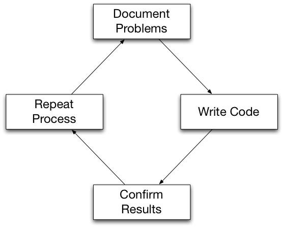
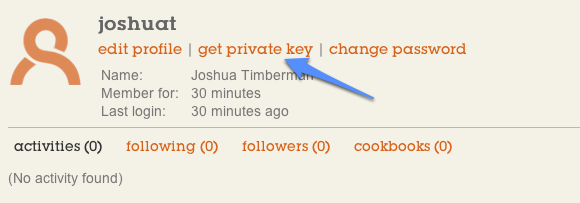

# Getting Started

.notes These course materials are Copyright © 2010-2011 Opscode, Inc. All rights reserved.
This work is licensed under a Creative Commons Attribution Share Alike 3.0 License. To view a copy of this license, visit http://creativecommons.org/licenses/by-sa/3.0/; or send a letter to Creative Commons, 171 2nd Street, Suite 300, San Francisco, California, 94105, USA.

# Objectives

At completion of this unit you should...

* Understand infrastructure as code
* Understand resources, recipes and cookbooks concepts
* Be familiar with the tools that we use to manage infrastructure as code

# Infrastructure as Code

Enable reconstruction of the business from nothing but a source code
repository, application data backup and bare metal resources.

# Fully Automated Infrastructure

* Service Oriented Architecture
* Configuration Management
* Systems Integration

# Service Oriented Architecture

Composable

* Modular APIs
* Build complex applications

# Configuration Management

Policy Driven Process for system state

* Set policy by documenting problems
* Execute policy by writing code
* Audit policy by confirming results
* Test policy by repeating the process

# Policy Driven Process

# Systems Integration

Service Oriented Architecture

* Infrastructure components
* Network services

Configuration Management

* Policy defines how infrastructure behaves
* Combine and integrate the services

# The Chef Way: Configuration Management

* Declare policy with resources
* Collect resources into recipes
* Package recipes and supporting code in cookbooks
* Apply cookbooks on nodes by specific roles
* Run Chef to configure nodes for their role

# The Chef Way: Systems Integration

* Discovery through search
* 3rd generation programming language
* Fully expressive toolbox and primitives
* One run completely configures the system

# Resources

Resources are the fundamental configuration object.

Chef manages resources on the node so they comply with policy.

# Resources

Declare some aspect of policy

* The apache2 package should be installed.
* The application user should be created.

# Resources

Abstract the details. The commands:

* apt-get install apache2
* useradd application

Become resources:

* package “apache2”
* user “application”

# Resources

Resources take idempotent actions through providers.

Providers know how to determine the current state.

Providers do not take action if the resource is in the declared state.

# Resources

Non-compliance with policy is a bug.

Chef converges the node to make it compliant with the policy.

A single Chef run should completely converge the node.

# Resources

Resources are data driven.

* Packages have versions
* Users have home directories, shells and numeric IDs.

This data can come from multiple sources, either by documenting in the code itself or an external source.

# Resources Chef Can Configure

* directories, files, templates, remote files
* packages, services, users, groups
* scripts, commands, ruby code blocks
* subversion and git code repositories
* application deployment, HTTP requests
* network interfaces, filesystem mounts

Chef includes over 25 different kinds of resources.

# User-created Resources

Chef is flexible and extensible and new resources and providers can be
created.

* Cookbook LWRPs (Lightweight DSL)
* Cookbook Libraries

# What Does a Resource Look Like?

* Resources have a type
* Resources have a name
* Resources take parameter attributes
* Resources specify the action to take

# Example Resource

    @@@ ruby
    template "/tmp/config.conf" do
      source "config.conf.erb"
      owner "root"
      group "root"
      mode 0644
      action :create
    end

.notes in the absense of parameters, default values are assumed. same
with actions

# Resources Have Sane Defaults

Each resource has a "name attribute."

This corresponds to a parameter attribute as the default value.

Parameter attributes all have default values internal to Chef. Specify your own to be explicit, or to change the default.

Resources also have a default action. The default value depends on the
resource type.

# Recipes

Recipes are the majority of the code written to execute the policy.

Recipes contain declarative resources.

Supporting code for recipes can also be written as libraries, or new
resources.

# Recipes

Internal Ruby domain-specific language.

* You need a 3rd generation programming language.
* You can’t be limited by the language.

# Recipes

Recipes are processed in the order they are written.

* Ruby code is evaluated.
* Ruby recognized as Resources are added to the resource collection.
* Chef walks the resource collection to configure the resources.
* Providers take action to configure the resource as it was declared.

# How Are Recipes Applied?

Nodes have a list of recipes they will run.

This run list can include recipes that also include other recipes.

These are applied to the node in the order listed.

# Cookbooks

Cookbooks are packages for recipes.

They are organized into directories.

Cookbooks contain one or more recipes.

Cookbooks can also contain other components.

# Cookbooks

Download existing cookbooks

* http://community.opscode.com

Create new cookbooks

Modify cookbooks

Upload cookbooks to the Chef Server

# Lab Exercise

## Getting Started: Part 1

# Sign up for Hosted Chef

## http://opscode.com

.notes If you haven’t signed up for Opscode Hosted Chef, we’re going
to do that now.

# Free Up to 5 Nodes

.notes Opscode Hosted Chef is free up to 5 nodes, and we'll use less
than that for the class.

# Sign up for Hosted Chef

.notes Select the "free trial" button to get the signup form.

# About You

Organization short name:

* Alphanumeric
* Hyphen and underscore

.notes Fill out accurate information. If you ever want support, we
need valid contact information on file.
The organization shortname should be lowercase letters and numbers. It
can include hyphen and underscore.

# Next Steps

Verify your email address.

# Next Steps

Select "Experienced with Chef" to go to the Management Console.

# Download Organization Assets

## https://manage.opscode.com

.notes Download the organization validation key and knife
configuration file for the organization. Save them somewhere such as
~/Downloads

# Download User Private key

.notes Click your username in the upper right corner. Then get the
private key for your user. Save this in the same directory as the
organization validation key and the knife configuration file.

# Sign-up Artifacts

* Opscode Hosted Chef Login
* Opscode Hosted Chef Organization
* User private key
* Validation or Organization key
* Knife Configuration file

# Tools of the Trade

In building infrastructure as code, we have several tools in the toolbox.

Non-Chef tools:

* Shell (Bash, Zsh, Powershell, Cmd.exe)
* Text editors (Emacs, Vim, Notepad++)
* Version control systems (Git, Subversion, Perforce)
* Ruby programming language

# Tools of the Trade

Chef itself comes with several tools.

* ohai - data gathering
* knife - command-line API and management tool
* chef-client & chef-solo - application to run Chef
* shef - interactive Ruby console for Chef

# Chef Tools

Common traits of Chef’s toolbox:

* --help
* Configuration

# Ohai

Ohai is a separate library that gets installed with Chef.

It uses plugins to profile the local system when Chef runs to gather
information.

This data gets stored on the Chef Server.

Ohai is usually configured via the chef-client configuration file
(`/etc/chef/client.rb`), it has no other default configuration file.

# Knife

Knife is the “swiss army knife” of infrastructure management tools. It is used for a number of tasks:

* managing the local Chef repository
* interact with the Chef Server API
* interact with cloud computing providers’ APIs
* extend with custom scripts and tools

The default configuration file for Knife is `.chef/knife.rb`.

.notes the configuration works like git, it looks in the current
directory for .chef/knife.rb, then goes up until it finds one, falling
back to `~/.chef/knife.rb`.

# Knife Sub-commands

General format of knife command-line:

    knife COMMAND verb noun (options)

This is consistent for Chef API, but some differences across other
uses.

# Knife Command Examples

    knife node show NODENAME
    knife cookbook upload fail2ban
    knife role edit webserver

# Knife Contextual Help

    knife --help
    knife sub-command --help
    knife sub-command verb --help

# Knife Man Pages

Knife has built-in man pages.

    knife help
    knife help list
    knife help knife
    knife help TOPIC
    knife help node

# Chef Client & Chef Solo

The programs chef-client and chef-solo load the Chef library and make
it available to apply configuration management with Chef.

Both programs know how to configure the system given the appropriate
recipes found in cookbooks.

# Chef Client

chef-client talks to a Chef Server API endpoint, authenticating with
an RSA key pair. It retrieves data and code from the server to
configure the node per the defined policy.

List of recipes can be predefined, assigned to a node on the Chef
Server, and retrieved when chef-client runs.

The default configuration file is `/etc/chef/client.rb`.

# Chef Solo

chef-solo operates without a Chef Server. It requires that all the
recipes it needs are available, and that it be told what to run on the
node.

A JSON file is passed to chef-solo to give it these instructions in a
`run_list` for the node.

The default configuration file is `/etc/chef/solo.rb`.

# Shef

Shef is an interactive Ruby console that supports attribute and recipe
contexts, as well as interactive debugging features.

Shef can be configured to talk to a Chef Server to interact with the
API directly.

We will see some examples of Shef in action this week, but not cover
it in great detail.

The default configuration file is `~/.chef/shef.rb`.

# Tools of the Trade

We also work with two other things conceptually that are not tools.

* JSON
* Chef repository

# JSON

    @@@javascript
    {
      "id": "json_example",
      "number": 120,
      "an_array": [ 1, 2, 3 ],
      "a_hash": { "foo": "bar" }
    }

# Chef Repository

Very simply, the Chef Repository is a version controlled directory
that contains cookbooks and other components relevant to Chef.

It contains Infrastructure as Code.

Knife already knows how to interact with many parts of the repository.

We’ll look at each part of the repository when we get to the relevant
section.

# Configuration

Each tool that Chef comes with has its own configuration file.

Configuration files populate values in the Chef::Config object.

Chef comes with sane default values for all configuration options that
can be changed.

Context of the configuration file to the appropriate tool is
important.

# Knife Configuration File

Knife looks for its configuration file, knife.rb automatically.

* $PWD/.chef/knife.rb
* $PWD/".."/.chef/knife.rb
* ~/.chef/knife.rb

# Knife Configuration Options

Options set in the knife configuration file have two namespaces.

One applies to `Chef::Config` directly.

The other applies to `Chef::Config[:knife]`.

Context is important.

# Example Knife Configuration

    @@@ruby
    # ~/chef-repo/.chef/knife.rb
    current_dir = File.dirname(__FILE__)
    log_level              :info
    log_location           STDOUT
    node_name              "USERNAME"
    client_key             "#{current_dir}/USERNAME.pem"
    validation_client_name "ORGNAME-validator"
    validation_key         "#{current_dir}/ORGNAME-validator.pem"
    chef_server_url        "https://api.opscode.com/organizations/ORGNAME"
    cache_type             'BasicFile'
    cache_options( :path => "#{ENV['HOME']}/.chef/checksums" )
    cookbook_path          ["#{current_dir}/../cookbooks"]
    # "knife" namespace
    knife[:aws_access_key_id]     = ENV['AWS_ACCESS_KEY_ID']
    knife[:aws_secret_access_key] = ENV['AWS_SECRET_ACCESS_KEY']

# chef-client Configuration

The default configuration file for chef-client is `/etc/chef/client.rb`.

Configuration is applied directly to Chef::Config, there are no other
namespaces.

Chef uses default values for anything not specified in the
configuration.

# Example chef-client Configuration

    @@@ruby
    log_level        :info
    log_location     STDOUT
    chef_server_url  "https://api.opscode.com/organizations/ORGNAME"
    validation_client_name "ORGNAME-validator"
    # Using default node name

# Command-line Options Override

Options passed on the command-line override values in the
configuration file.

    @@@bash
    chef-client -l debug
    chef-client -N node-name
    chef-client -S https://api.opscode.com/organizations/OTHER
    chef-client --help

# Chef Server

Centralized publishing system for infrastructure data and code.

* Stores node, role and user-entered data
* Indexes stored data
* Stores cookbooks
* Provides an API for management and discovery

# Chef Server API Implementations

Opscode Hosted Chef

Opscode Private Chef

Open Source Chef Server

Commis (Python)

# Chef Server Components

# Chef Server API Services

API Server (HTTP & JSON, Authentication)

Data storage (JSON documents, Cookbooks)

Message queue (Search indexing, other services)

Search Engine (Full text search)

Web management console (API client)

# Chef Server Security

All communication is initiated by API clients, and never from the Chef
Server directly.

Communication is over HTTP. Opscode Hosted Chef and Opscode Private
Chef use HTTPS.

All API requests are authenticated using digital signatures.

All API requests for Opscode Hosted Chef and Opscode Private Chef are
authorized with role-based access controls.

Custom data ("data bags") can be encrypted with user-supplied keys.

# Working with Chef

# Summary

You should now be able to...

* Describe infrastructure as code
* Describe resources, recipes and cookbooks
* Use the tools that come with Chef

# Additional Resources

* http://wiki.opscode.com/display/chef/Resources
* http://wiki.opscode.com/display/chef/Recipes
* http://wiki.opscode.com/display/chef/Chef+Repository
* http://wiki.opscode.com/display/chef/Chef+Configuration+Settings
* http://wiki.opscode.com/display/chef/Server+API
* http://community.opscode.com/cookbooks

# Lab Exercise

## Getting Started: Part 2
