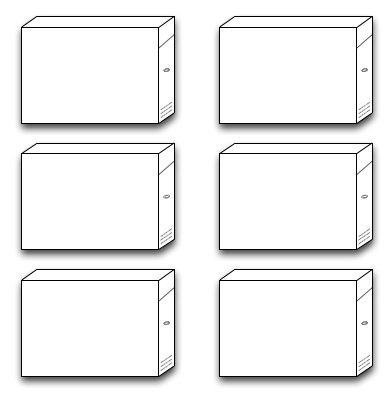
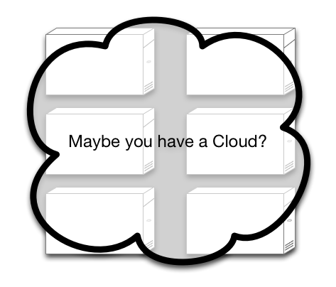
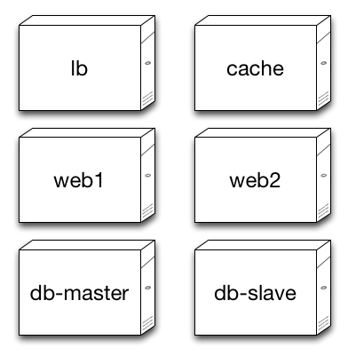
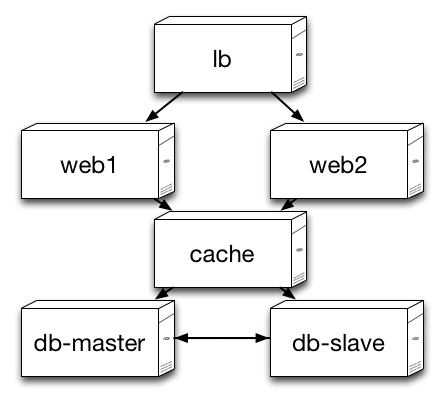
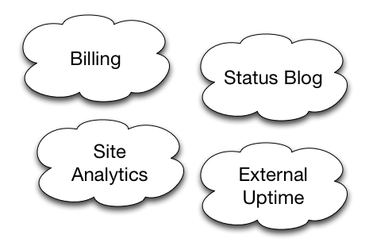

# Chef Fundamentals

Welcome to Chef Fundamentals!

OPS150-04.01 - January, 2012

Created and Sponsored by Opscode, Inc.

.notes These course materials are Copyright © 2010-2012 Opscode,
Inc. All rights reserved.  This work is licensed under a Creative
Commons Attribution Share Alike 3.0 United States License. To view a
copy of this license, visit
http://creativecommons.org/licenses/by-sa/3.0/us; or send a letter to
Creative Commons, 171 2nd Street, Suite 300, San Francisco,
California, 94105, USA.

# Logistics

* Start and finish time
* Breaks
* Lunch
* Restrooms
* Refreshments
* Parking

# Instructor

* Name
* Company / Group
* Experience w/ Configuration Management or Chef itself
* Contact information

.notes Contact information should minimally include email address.

# Students

* Name
* Company / Group
* Experience w/ Configuration Management or Chef itself
* Objective for course

# Course Objectives

* Understand Chef's tools and architecture
* Obtain, create and modify cookbooks
* Work with the Chef Server API
* Understand common patterns used by Opscode
* Understand Opscode's products

Chef is a complex system and we could spend 2 weeks on it and not
cover everything. This course aims to teach students the fundamentals
and most important topics, terminology and common hurdles.

# Topics Not Covered

We can't cover everything. Specifically, this course does not cover:

* Direct comparison to other tools.
* In depth details on advanced topics.
* Discussion of application deployment strategies.
* Setup/management of Open Source Chef Server.

# Learning Chef

This course is to facilitate learning Chef.

We will take frequent breaks and do several hands on exercises.

Please keep questions on topic for the section. Some questions will
cover subject material that will be covered later.

Extensive or detailed questions can be answered at the end of the
relevant section, day or at the end of the course.

# Agenda: Day 1

* Introduction
* Getting Started
* Anatomy of a Chef Run
* Cookbooks, Recipes and Resources
* Just Enough Ruby for Chef

# Agenda: Day 2

* Resources in Depth
* Troubleshooting
* Chef Node
* Roles
* More Cookbooks

# Agenda: Day 3

* Multiple Nodes and Search
* Data bags
* Additional Topics
* Chef Development and Further Resources

.notes Additional topics include: Environments, LWRPs, Plugins,
Reporting. This also may include questions asked during the course
that have not been covered.

# Agenda: Hack Day

Opscode public Chef Fundamentals training is often followed by a Hack Day.

* Mini-tutorials/talks
* Demonstrations
* Collaboration and learning
* Hacking on Chef, cookbooks and more!
* Venue varies by location

.notes Discuss any relevant hack day event logistics. If no hack day, skip.

# Course Artifacts

At the end of the class you will have:

* Opscode account and Opscode Hosted Chef organization (Chef Server)
* Workstation setup to work with Opscode Hosted Chef
* Repository that can be used to get started managing infrastructure
  as code with Chef

# About Best Practices

This course encompasses what we consider "best practices".

Many things in Chef have multiple approaches. We will focus on one,
but may mention others for awareness.

Best practices themselves are subjective.

Chef is flexible and you can make it do almost anything you want.

# About the course materials

Opscode's Chef Fundamentals training materials are dual-licensed.

* Creative Commons Attribution-ShareAlike (CC BY-SA) for slides,
  guides and notes.
* Apache License, Version 2.0 for supporting code and significant
  example code on slides.

.notes Usually, "significant example code" is taken from source code
in Opscode open source projects such as cookbooks.

# Introduction to Chef

* Configuration Management
* System Integration
* Core Principles

.notes Take 5 if we haven't already. Now that the course is
introduced, let's introduce Chef.

# Configuration Management

"Keep track of all the stuff you do to take a system from 'bare metal'
to 'doing its job'." - Adam Jacob, Web Operations (O'Reilly, 2010)

* Wiki notes, copy/paste
* Scripting, ssh-in-a-for-loop
* Automation frameworks

.notes Using an automated framework is why we're all here, after all.

# Bare Metal

We have computers sitting in a rack somewhere.

# Bare Metal...Cloud?

Or, we have an idea of what computers we need running in a cloud
somewhere.

# Doing their Job

All the configuration management has been done, now they're doing
their jobs.

# System Integration

Systems simply running with the right software don't provide value to
the business.

They need to be integrated together.

* Load balancers connect to the right web servers.
* Web servers hit the database or the cache layer.
* Database servers are clustered for availability.

# System Integration

In a typical architecture, this is complex. Six systems talk to each
other, and two of those are a complex subsystem of their own - HA
database.

# System Integration

In modern infrastructures, applications are not simply three-tier
architectures anymore. Other components are added. Additional services
are required to scale or add end-user features. We already have
caching here, but wait, there's more:

* Message queues
* Search engines
* Third party services (e.g., billing, uptime/status, analytics)

Don't forget monitoring and trending!

# Complexity Grows

# Chef Can Help

Chef is designed to help manage this kind of complexity. You may have
met already!

* Configuration management tool
* Systems integration framework
* API for infrastructure management

# Chef: The Tool

Chef is a tool for configuration management.

* Declarative: What, not how
* Idempotent: Only take action if required
* Convergent: Takes care of itself

.notes Each of these topics is discussed in greater detail.

# Declarative Resources

You configure systems with Chef by writing self-documenting code. This
code is lists of *Resources* that configure the system to do its job.

Chef manages system resources with a declarative interface that
abstracts the details.

    @@@ruby
    package "bash" do
      action :install
    end

.notes This is the equivalent to the command `apt-get install bash` or
`yum install bash`.

# Idempotent Actions

Chef Resources have *Providers* that take idempotent action to
configure the resource, but only if it needs to change.

    INFO: Processing package[apache2] action install (apache2::default line 20)
    DEBUG: package[apache2] checking package status for apache2
    DEBUG: package[apache2] current version is 2.2.20-1ubuntu1.1
    DEBUG: package[apache2] candidate version is 2.2.20-1ubuntu1.1
    DEBUG: package[apache2] is already installed - nothing to do

.notes Chef providers handle the details of checking the current state
of the resource. Different platforms may have different providers for
managing the same type of resource, yum vs apt, init vs upstart.

# Convergent Nodes

Chef runs on the system, configuring the *Node*. The node is the unit
of authority about itself.

In Chef, a single run should completely configure the system. If it
does not, it is a bug (in your code, on the system, or in Chef
itself).

.notes We'll talk more about how Chef converges the node when we cover
Anatomy of a Chef run.

# Chef: The Framework

Chef provides a framework for system integration.

* Resources are written in Chef Recipes, a Ruby domain-specific
  language (DSL).
* Recipe helpers such as `search` allow dynamic data usage.
* Chef provides a library of primitives that can be used for other
  purposes.

.notes Each of these topics is discussed in greater detail.

# Recipe Ruby DSL

Ruby is a 3rd generation interpreted programming language. Ruby has
features that make it easy to create domain specific languages. This
lends itself quite nicely to configuration management.

In Chef, Ruby gets out of the way, but it is still there when you need
it.

Chef *Recipes* are a pure Ruby domain specific language. They are
collected in *Cookbooks* along with associated components like config
files or libraries.

.notes By "Gets out of the way", the DSL doesn't require intimate Ruby
knowledge.

# Recipe Helpers

Chef provides a number of recipe helpers to obtain and manipulate data
to use in Resources.

*Search* is used to discover information like IP addresses about other
 systems.

Arbitrary data about the infrastructure can be stored in *Data Bags*
and accessed in recipes.

# Library and Primitives

Chef can be used as a library within other applications. It speaks
JSON and the server has a RESTful API accessed over HTTP(S).

Cookbooks can extend Chef with new libraries, including new resources
and helpers to interact with 3rd party services.

Chef's included tools have plugin systems you can use to extend them.

# Chef: The API

The Chef Server provides a network accessible API to stored data.

* Information about configured nodes
* Configuration policy in Cookbooks
* Descriptions of what policy to apply

# Node Data

Chef gathers information about the node it is running on and saves
this data to the Chef Server.

Node data is generated as a JSON key/value structure.

The JSON data is indexed for search by the Chef Server.

# Configuration Policy

Policy about the nodes is written in recipes, which are stored in
*Cookbooks*.

Cookbooks are uploaded to the Chef Server and distributed to the nodes
that should be configured.

Cookbooks have versions and dependencies, both of which affect what
code gets executed on particular nodes.

# Applying the Policy

Tying it all together are `roles` which are descriptions of the nodes.

A `webserver` role contains the list of cookbooks and node-specific
information required to fulfill serving HTTP traffic.

Chef inspects the node's role to determine what it should be to do its
job.

# Chef Summary: Configuration Management

* Declare configuration policy with resources
* Collect resources into recipes
* Package recipes and supporting code in cookbooks
* Apply cookbooks on nodes by specific roles
* Run Chef to configure nodes for their role

# Chef Summary: Systems Integration

* Discovery through search
* 3rd generation programming language
* Fully expressive toolbox and primitives
* One run completely configures a single system

# Questions

* What is configuration management?
* What is system integration?
* What are declarative resources?
* How are Chef resources idempotent?
* What language are Recipes written in?
* How are recipes distributed to nodes?
* Student questions?
